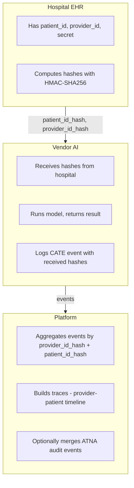

<p align="center">
  
</p>

<p align="center">
  
  
  
</p>

<p align="center">
  <strong>Audit and track clinical AI usage</strong> — provenance logging with anonymous patient and provider identifiers
</p>

---

## Overview

**CATE** (Clinical AI Telemetry) is a minimal specification and SDK for logging clinical AI interactions—both traditional ML (predictions, risk scores) and LLMs (summarization, drafting)—with audit trails that support medical malpractice defense.

**Key features:**

- **Anonymous identity** — Hospitals compute patient/provider hashes; vendors never see raw IDs
- **Trace grouping** — Events group by provider–patient session for unified timelines
- **ATNA integration** — Include IHE ATNA audit logs in traces for full context
- **Spec-first** — JSON schema, clear spec, minimal vendor integration burden

---

## Installation

```bash
pip install -e .
```

Or with a virtual environment:

```bash
python -m venv .venv && source .venv/bin/activate  # Linux/macOS
pip install -e .
```

---

## Quick Start

### Hospital: Compute identity hashes

```python
from cate import compute_patient_hash, compute_provider_hash

patient_id_hash = compute_patient_hash(secret="your-tenant-secret", patient_id="MRN123", encounter_id="enc-456")
provider_id_hash = compute_provider_hash(secret="your-tenant-secret", npi="1234567890")

# Include in every vendor request
```

### Hospital: Include in vendor requests

Send with each request (headers or body):

| Header | Description |
|--------|-------------|
| `X-CATE-Patient-ID-Hash` | Patient hash (includes encounter) |
| `X-CATE-Provider-ID-Hash` | Provider hash |

### Vendor: Pull headers and log events

Extract CATE headers from the incoming request, then pass them into the event:

```python
from cate import log_cate_trad_ml, log_cate_llm

# Pull CATE context from request headers (hospital sends these)
patient_id_hash = request.headers.get("X-CATE-Patient-ID-Hash")
provider_id_hash = request.headers.get("X-CATE-Provider-ID-Hash")

# Run your model, get prediction...
prediction = model.predict(input_data)

# Log event — pass through the header values
event = log_cate_trad_ml(
    patient_id_hash=patient_id_hash,
    provider_id_hash=provider_id_hash,
    model_id="sepsis-v2",
    vendor_id="acme",
    task_type="risk_prediction",
    output_label=prediction["label"],
    output_probability=prediction["probability"],
)
# Send event to your audit/collector
```

LLM example:

```python
patient_id_hash = request.headers.get("X-CATE-Patient-ID-Hash")
provider_id_hash = request.headers.get("X-CATE-Provider-ID-Hash")

response = llm.generate(prompt)

event = log_cate_llm(
    patient_id_hash=patient_id_hash,
    provider_id_hash=provider_id_hash,
    model_id="clinical-llm-1.0",
    vendor_id="docu-ai",
    interaction_type="summarization",
    output_token_count=len(response.split()),
)
```

### Platform: Build traces

```python
from cate import build_trace

trace = build_trace(events)
# patient_id_hash, provider_id_hash, start_time, end_time, events
```

---

## Architecture



---

## Project Structure

```
CATE/
├── README.md
├── pyproject.toml
├── spec/
│   ├── overview.md          # Full specification
│   └── atna-extension.md    # ATNA integration
├── schemas/
│   ├── event.schema.json
│   └── trace.schema.json
├── cate/
│   └── __init__.py          # Python SDK
├── examples/
│   ├── trad-ml.json
│   ├── llm.json
│   ├── vendor_trad_ml.py    # Pull headers → create event
│   └── vendor_llm.py       # Pull headers → create event
└── tests/
```

---

## Specification

| Document | Description |
|----------|-------------|
| [spec/overview.md](spec/overview.md) | Full spec: request flow, trace, event, identity |
| [spec/atna-extension.md](spec/atna-extension.md) | ATNA integration: add patient_id_hash, provider_id_hash to audit logs |
| [schemas/event.schema.json](schemas/event.schema.json) | JSON Schema for events |
| [schemas/trace.schema.json](schemas/trace.schema.json) | JSON Schema for traces |

---

## API Reference

| Function | Description |
|----------|-------------|
| `compute_patient_hash(secret, patient_id, encounter_id)` | HMAC-SHA256 patient hash |
| `compute_provider_hash(secret, npi_or_provider_id)` | HMAC-SHA256 provider hash |
| `generate_event_id()` | New event ID |
| `log_cate_trad_ml(...)` | Log CATE traditional ML event |
| `log_cate_llm(...)` | Log CATE LLM event |
| `build_trace(events)` | Build trace from events |
| `validate_event(event)` | Validate event (returns list of errors) |

---

## License

Creative Commons Attribution 4.0 International (CC BY 4.0). See [LICENSE](LICENSE) for details.
